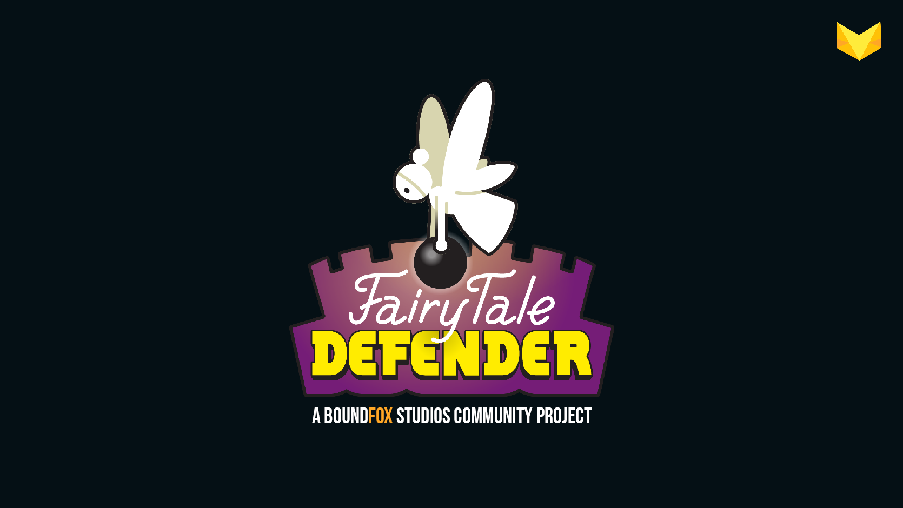

[][1] [][2] 

# Boundfox Studios Community-Projekt

[_I speak english._](#english)

[ [Dokumentation](https://boundfoxstudios.github.io/community-project) ] [ [Mitmachen](https://boundfoxstudios.github.io/community-project/docs/contributing/) ] [ [Roadmap](https://boundfoxstudios.github.io/community-project/docs/roadmap) ]

Hallo!

Schön, dass Du hier her gefunden hast zu unserem Community-Projekt (oder eher auch ein Community-Experiment).
In diesem Repository (kurz Repo) findest Du so ziemlich alles, was zum Community-Projekt gehört.

Am besten liest Du Dich erstmal etwas durch die [Dokumentation](https://boundfoxstudios.github.io/community-project).
Diese ist umfangreich und enthält alle wichtigen Informationen.

Als Genre wollen wir gemeinsam ein Tower Defense im Mittelalter-Theme umsetzen.
Aktuell sind wir dabei zu definieren, welche Features implementiert werden sollen.

## Ziele

Das Community-Projekt verfolgt mehrere Ziele:

* Ein kleines, fertiges Spiel, das kostenfrei auf Steam spielbar ist.
* Alle, die Lust haben, sich zu beteiligen, sollen die Chance dazu haben.
* Lernen! Wir sind ein [Tutorial-Kanal auf YouTube][1], daher steht natürlich auch das Lernen im Vordergrund.
* Spaß! Alle, die mitmachen, sollen Spaß bei der Sache haben, sei's bei der Umsetzung ihrer Aufgabe oder beim Plausch mit der Community. 

## Projektfortschritt verfolgen

* Interessiert Dich nur der Fortschritt des Projekts, dann bist Du auf dem [YouTube-Kanal][1] genau richtig. 
  Hier werden immer wieder Videos erscheinen mit dem aktuellen Stand.
  Ältere Videos findest Du in der [Playlist](https://www.youtube.com/playlist?list=PLxVAs8AY4TgchOtBZqg4qvFeq6w74ZtAm).
* Du hast das Spiel schon gespielt und möchtest einen Fehler melden? Klasse! Das kannst Du entweder direkt hier auf [GitHub](https://github.com/BoundfoxStudios/community-project/issues) (Du benötigst dafür einen kostenfreien Account) machen oder natürlich auch auf [Discord][2].

## Roadmap

Eine kleine Roadmap findest Du [hier](https://boundfoxstudios.github.io/community-project/docs/roadmap).

Eine MindMap mit aktuell allen verrückten Ideen findest Du [hier](https://miro.com/app/board/uXjVPSFGLlk=/?share_link_id=580613867296). 
Falls Du hier noch was ergänzen möchtest, schreib gerne ein [Issue](https://github.com/BoundfoxStudios/community-project/issues/new?assignees=&labels=Triage&template=misc.yml) oder direkt in [Discord][2].

## Ich will mitmachen!

Super! Spieleentwicklung ist aufwendig - auch wenn wir vorhaben, ein kleines Spiel zu erstellen - helfende Hände und kreative Köpfe sind daher immer willkommen!

_Ich kann aber gar nicht programmieren._ 
Kein Problem! Ein Spiel zu entwickeln bedeutet viel mehr als Programmieren zu können. 
Beispielsweise werden auch 3D-Modellierer, 2D-Designer, Musiker, Effekt-Designer, Spieletester, Übersetzer und vieles mehr benötigt.

Am Besten schaust Du Dir zuerst das [Intro-Video auf YouTube](https://youtu.be/QFcMmSl0cWA) an, danach kannst Du [hier](https://boundfoxstudios.github.io/community-project/docs/contributing/) in der [Dokumentation](https://boundfoxstudios.github.io/community-project/docs/) lesen, wie Du Dich am Community-Projekt beteiligen kannst. 

Beachte beim Mitmachen auch unseren [Code of Conduct](CODE_OF_CONDUCT.md), sodass wir hier alle, die mitmachen möchten, respektvoll miteinander umgehen.

### Wer macht bereits mit?

Diese wundervollen Menschen haben sich bisher am Community-Projekt beteiligt:

<!-- ALL-CONTRIBUTORS-LIST:START - Do not remove or modify this section -->
<!-- prettier-ignore-start -->
<!-- markdownlint-disable -->
<table>
  <tbody>
    <tr>
      <td align="center"><a href="https://github.com/BlackJack237"> <b>BlackJack237</b></a> <a href="https://github.com/BoundfoxStudios/community-project/commits?author=BlackJack237" title="Code">💻</a></td>
      <td align="center"><a href="https://github.com/Salja"> <b>Christian Schamara</b></a> <a href="https://github.com/BoundfoxStudios/community-project/commits?author=Salja" title="Code">💻</a></td>
      <td align="center"><a href="https://github.com/GodGamer948"> <b>GodGamer948</b></a> <a href="https://github.com/BoundfoxStudios/community-project/commits?author=GodGamer948" title="Documentation">📖</a></td>
      <td align="center"><a href="https://github.com/Julia-dev1"> <b>Julia-dev1</b></a> <a href="https://github.com/BoundfoxStudios/community-project/commits?author=Julia-dev1" title="Documentation">📖</a></td>
      <td align="center"><a href="https://github.com/M4lph"> <b>M4lph</b></a> <a href="https://github.com/BoundfoxStudios/community-project/commits?author=M4lph" title="Code">💻</a> <a href="https://github.com/BoundfoxStudios/community-project/commits?author=M4lph" title="Documentation">📖</a> <a href="#ideas-M4lph" title="Ideas, Planning, & Feedback">🤔</a></td>
      <td align="center"><a href="https://manuel-rauber.com"> <b>Manuel Rauber</b></a> <a href="https://github.com/BoundfoxStudios/community-project/commits?author=ManuelRauber" title="Code">💻</a> <a href="https://github.com/BoundfoxStudios/community-project/commits?author=ManuelRauber" title="Documentation">📖</a> <a href="#ideas-ManuelRauber" title="Ideas, Planning, & Feedback">🤔</a> <a href="#infra-ManuelRauber" title="Infrastructure (Hosting, Build-Tools, etc)">🚇</a> <a href="#maintenance-ManuelRauber" title="Maintenance">🚧</a> <a href="#projectManagement-ManuelRauber" title="Project Management">📆</a> <a href="https://github.com/BoundfoxStudios/community-project/pulls?q=is%3Apr+reviewed-by%3AManuelRauber" title="Reviewed Pull Requests">👀</a></td>
      <td align="center"><a href="https://thorsten-kattanek.de"> <b>Thorsten Kattanek</b></a> <a href="https://github.com/BoundfoxStudios/community-project/commits?author=ThKattanek" title="Code">💻</a></td>
    </tr>
    <tr>
      <td align="center"><a href="https://github.com/TipiliF"> <b>TipiliF</b></a> <a href="https://github.com/BoundfoxStudios/community-project/commits?author=TipiliF" title="Documentation">📖</a> <a href="#ideas-TipiliF" title="Ideas, Planning, & Feedback">🤔</a></td>
      <td align="center"><a href="https://kordesii.itch.io/"> <b>Tobby</b></a> <a href="https://github.com/BoundfoxStudios/community-project/commits?author=realTobby" title="Code">💻</a></td>
      <td align="center"><a href="https://github.com/fastFox2"> <b>fastFox2</b></a> <a href="https://github.com/BoundfoxStudios/community-project/commits?author=fastFox2" title="Code">💻</a> <a href="https://github.com/BoundfoxStudios/community-project/commits?author=fastFox2" title="Documentation">📖</a></td>
    </tr>
  </tbody>
</table>

<!-- markdownlint-restore -->
<!-- prettier-ignore-end -->

<!-- ALL-CONTRIBUTORS-LIST:END -->

## Was bedeutet denn ...?

Du wirst im Laufe der Dokumentation sicher über Begrifflichkeiten stolpern, die Du so noch nicht kennst.
Dann wirf am Besten einen Blick in das [Glossar](https://boundfoxstudios.github.io/community-project/docs/glossary).
Hier versuchen wir alle Begriffe zu sammeln und zu erklären, um das allgemeine Verständnis zu verbessern.

## Ansprechpartner

Aktuell ist [Manu](https://github.com/ManuelRauber) Ansprechpartner für alles zum Projekt.
Am besten erreichst Du ihn auf [Discord][2].

## Wichtige Links

* [YouTube-Kanal][1]
* [Discord][2]
* [Boundfox Studios Website](https://boundfoxstudios.com)

## Lizenz

Die [Lizenz](LICENSE) dieses Repos ist die GPLv3.
Das bedeutet ganz grob folgendes; alle weiteren Informationen siehst Du in der [Lizenz](LICENSE) oder [hier](https://choosealicense.com/licenses/gpl-3.0/).

Du darfst:

* dieses Projekt kommerziell nutzen,
* das Projekt verteilen,
* das Projekt modifizieren.

Du musst:

* den Quelltext offen legen,
* Lizenz und Copyright Hinweis beilegen,
* deine Änderungen unter gleicher Lizenz halten.

## English

Hi! 

You've just found the Boundfox Studios' community project. 
This project is a little community experiment to create a small and finished game that can be released on Steam.
Since we're a German community all resources, except the code, will be in German.
For all written content you can easily use an online translation tool. 

Please don't hesitate to contribute, file bugs, make suggestions, etc. in English.
You can also join our [Discord][2] server where we also have English channels.

Have fun!

<!-- Reference Links -->

[1]: https://youtube.com/@BoundfoxStudios
[2]: https://discord.gg/tHqNzMT
