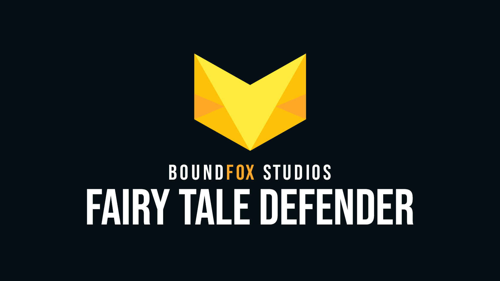

Es freut uns sehr, wenn wir Dein Interesse geweckt haben, dass Du Dich in irgendeiner Form am Community-Projekt beteiligen möchtest.
Schau Dir am besten zuerst das [Intro-Video auf YouTube](https://youtu.be/QFcMmSl0cWA) an und lies dann hier weiter.
Bitte beachte zudem unseren [Code of Conduct][3], sodass wir hier alle miteinander respektvoll umgehen und eine angenehme Atmosphäre schaffen.

Aktuell haben sich  Menschen am Projekt beteiligt!

{}
Kleines Vorwort: Wir stehen noch ganz am Anfang dieses Projektes. Wie es für ein neues Projekt üblich ist, ist der Anfang oft am schwierigsten. Es gibt noch keine Strukturen, keine Dinge, bei denen man sich orientieren kann.
Wir gehen daher davon aus, dass der Anfang erstmal recht chaotisch ablaufen wird und sich mit der Zeit dann findet.
Sei es technisch, kreativer oder organisatorischer Natur. Alles ist noch offen und alles wird nach und nach eine Struktur finden. :)
{}

## Wer kann sich beteiligen?

Jeder Mensch auf dieser Welt. :) Spieleentwicklung ist ein riesiges Thema und es gibt immer was zu tun.
Wichtig ist, dass Du Lust und Laune mitbringst und natürlich Spaß an der ganzen Thematik hast.

## Was muss ich können?

Es wird (fast) keine Rolle spielen, ob Du ein Anfänger oder bereits ein alter Hase bist.
Im Laufe des Projektes werden wir viele Aufgaben haben, sodass jeder etwas für sich finden kann.

Wir alle werden an diesem Projekt sehr viel lernen und das ist auch eines der [Ziele](https://github.com/boundfoxstudios/community-project#ziele) - gerade als Tutorial-Kanal auf YouTube.

{}
Eine Sache ist allerdings für alle Mitmacher wichtig: Die Benutzung von [Git](https://git-scm.org), bspw. mit einer Software wie GitHub-Desktop.
Auf unserem YouTube-Kanal findest Du dazu ein [kleines Video](https://www.youtube.com/watch?v=Vo22tnUs50o). 

Aber: Git hat einen hohen Funktionsumfang, daher solltest Du Dich neben dem Video auf dem Kanal auch selbst mit Git beschäftigen. Über die Suchmaschine Deiner Wahl findest Du unzählige deutschsprachige Tutorials.

Ohne Git kannst Du (fast) nicht am Projekt mitmachen, es ist daher essentiell wichtig, dass Du Dir die Grundlagen aneignest, wie Du an den aktuellen Code kommst und wie ein Pull Request (PR) funktioniert.
{}

### Was kann ich tun? Welche Rollen gibt es?

Folgend eine Liste an Ideen, wie man sich an einer Spieleentwicklung beteiligen kann. Wahrscheinlich gibt es noch sehr viel mehr, als hier steht:

* Designer
  * 3D-Designer
    * Erstellen von Modellen (Umgebung, Gebäude, Fauna und Flora, ...)
    * Erstellen von Charakteren (Menschen, Tiere, ...)
    * Rigging und Animation
  * 2D-Designer
    * Benutzeroberflächen
    * Icons
    * Marketingbilder (z.B. für die Steam-Seite, Spiel-Logo, etc.)
* Entwickler
  * Game Code
  * Unity Editor-Erweiterungen
  * Shader/Shader-Graph
* Sound
  * Musik
  * Effekte
* Texter
  * Übersetzungen
  * Dokumentation
  * Tutorials
  * Marketingtexte (z.B. für die Steam-Seite)
* Organisation
* Game-Designer
  * Ideen entwickeln, ausarbeiten
* Spieletester
  * Testen und Fehler melden
  * Verbesserungen vorschlagen
* ... :)

## Verlässlichkeit

Dieser Abschnitt ist super wichtig, wenn Du Dich entschließt mitzumachen, in welcher Form auch immer.
Jedes Open Source Projekt funktioniert nur so gut, wie die Leute, die mitmachen.
Anfangs ist man immer Feuer und Flamme und gerne mal schnell mit dabei.
Aber: Dahinter steckt auch viel Arbeit, vor allem für uns, die es organisieren.

Daher ist das Thema Verlässlichkeit für uns super wichtig.
Wenn Du Dich entschließt mitzumachen und eine Aufgabe zu übernehmen (egal, ob diese groß oder klein ist), dann sind für uns in der Organisation zwei Dinge sehr wichtig:

1. Wir möchten uns darauf verlassen können, dass eine übernommene Aufgabe auch in einer endlichen Zeit fertig wird.
2. Falls Du, man weiß ja nie, wie das Leben spielt, keine Zeit mehr für die Aufgabe hast, dies auch einfach kommunizierst.
   Niemand wird Dir böse sein, falls es mal nicht klappt und je früher Du es mitteilst, umso einfacher können wir in der Organisation diese Aufgabe neu verteilen.

Kommunikation ist an dieser Stelle essentiell. Auch wenn Du Dir z.B. eine Aufgabe zutraust und dann ins Stolpern kommst, weil es doch schwerer ist als gedacht: kein Problem! Schreib in der Community, das gegenseitige Helfen ist genau das, was ein gemeinsames Projekt spannend macht.

## Ich möchte ...

* ... [technisch mitarbeiten](technical) (z.B. Entwickler)
* ... [visuell mitarbeiten](visual) (z.B. 3D-Designer, 2D-Designer)
* ... [auditiv mitarbeiten](auditory) (z.B. Musik, Sound-Effekte)

Fühlst Du Dich in dieser Liste noch nicht zu Hause, da Du z.B. eher Spieletester sein möchtest, kein Problem!
Dann bist Du zum aktuellen Stand des Projekte noch etwas zu früh dran.
[Verfolge gerne das Projekt](https://github.com/boundfoxstudios/community-project#projektfortschritt-verfolgen) und schau später wieder rein.
Sobald es mal "mehr vom Spiel gibt", werden weitere Rollen sich am Spiel beteiligen können.

## Wo finde ich, was es zu tun gibt? Wo sind die Aufgaben?

Eine Liste von Aufgaben wirst Du auf der [Issue-Seite][1] von unserem Community-Projekt finden.
Alternativ kannst Du auch einen Blick auf das [Projekt-Board][2] werfen.
Das bedeutet aber nicht, dass Du nur an diesen Aufgaben arbeiten kannst.
Wenn Du einen Bug gefunden hast oder Dir eine tolle Idee kommt, dann lass uns gerne darüber reden und eventuell machen wir daraus eine neue Aufgabe für Dich.

Hier erneut ein Hinweis zum Thema [Verlässlichkeit](#verlässlichkeit): Bitte versuche immer nur eine Aufgabe zu übernehmen, diese abzuschließen (bzw. mindestens einen Pull Request zu stellen), bevor Du eine weitere Aufgabe übernimmst.

### Wie kann ich eine Aufgabe übernehmen?

Sowohl auf der [Issue-Seite][1] und auf dem [Projekt-Board][2] findest Du alle aktuellen Aufgaben.
Alle Aufgaben, die mit `Triage` markiert sind, bzw. beim Projekt-Board in der Spalte `Triage` sind, müssen noch vorsortiert werden.

Für Dich relevant sind daher alle Aufgaben, die **nicht** mit Triage markiert sind.
Wenn Dich eine konkrete Aufgabe interessiert, klicke sie an, um die Dateilseite zu kommen.
Lese Dir hier durch, um was es genau geht und stelle gerne Rückfragen, falls Dir eine Information fehlt.
Sobald Du Dich entschließt, dass Du diese Aufgabe bearbeiten möchtest, schreibe einen Kommentar in dem folgender Text vorkommt: `.meine-aufgabe` - Du musst es exakt so schreiben, wie es dort steht, mit dem Punkt am Anfang, alles kleingeschrieben und dem Bindestrich.
Sobald Du den Kommentar abgeschickt hast, wird es ca. 30-60 Sekunden dauern, bis GitHub Dir diese Aufgabe zuweist. Ab jetzt kannst Du daran arbeiten. :-)

Falls Du eine Aufgabe findest, die schon jemand bearbeitet und Du auch dran interessiert bist, dann schreibe gerne einen Kommentar rein und melde Dich am besten kurz auf dem Discord-Server.

### Wie kann ich eine Aufgabe wieder abgeben?

Falls Dir irgendwas dazwischen kommt, Deine Aufgabe zu bearbeiten (siehe Thema Verlässlichkeit), dann öffnest Du einfach Deine Aufgabe auf GitHub und kannst rechts unter dem Punkt "Assignees" auf "Unassign me" klicken, dann wird Deine Aufgabe wieder zurückgegeben.
Zudem wirst Du, falls Du Dich länger nicht um Deine Aufgabe kümmerst, automatisch vom System angeschrieben und daran erinnert.

## Ich habe eine Aufgabe fertig, was mache ich damit?

Wenn Du eine Aufgabe fertig hast, dann hast Du in der Regel auch eine oder mehrere Dateien verändert, hinzugefügt, gelöscht, etc.
Jetzt wirst Du einen Pull Request erstellen, in dem Deine Änderungen sind und auch die Aufgabe verlinkt.
Bitte aktiviere beim Erstellen des Pull Requests die Option "Allow edits from maintainers".
Falls alles passt, werden Deine Änderungen von den [Ansprechpartnern](https://github.com/boundfoxstudios/community-project#ansprechpartner) ins Spiel übernommen werden.
Falls etwas nicht passt oder noch was unklar ist, dann wird es entsprechende Rückfragen geben.
Eventuell bedeutet das auch, dass Du erneut etwas anpassen musst, damit es dann schlussendlich zum Spiel passt.

## Dinge, die Du nicht tun darfst

Es gibt ein paar Dinge, die Du _wirklich_ nicht tun darfst, wenn Du mitarbeitest:

* Füge keine Dinge hinzu, die gegen unseren [Code of Conduct][3] verstoßen, also z.B. sexualisierte, gewaltverherrlichende Inhalte (Text, Bilder, ...), weiteres entnimm bitte dem [Code of Conduct][3].
* Füge keine Dinge hinzu, die Du nicht selbst erstellt hast oder nicht CC0 lizenziert sind. Auch Code von anderen Projekten darf nicht genutzt werden, außer er ist selbst Open Source.
  Bei CC0-Lizenzen ist es zwar nicht nötig, dass wir den Original-Autor erwähnen, aber es ist natürlich schön, wenn wir das tun. Wenn Du daher etwas CC0-lizenziertes nutzt, dass Du dies dokumentierst, sodass wir diesen Punkt in den Credits aufnehmen können.

Wenn Du Dich nicht an diese grundlegende Dinge hältst, behalten wir uns vor, Dich von der weiteren Zusammenarbeit mit diesem Projekt auszuschließen.

## Schlusswort

Wir freuen uns sehr, wenn Du beim Projekt mitmachen möchtest.
Es kann auch durchaus vorkommen, dass Dein Beitrag für sich gestellt super ist, aber er leider nicht zum Projekt passt.
Schließlich möchten wir sicherstellen, dass das Projekt in die richtige Richtung läuft und wir am Ende etwas spielbares in den Händen halten können.

Daher hat Boundfox Studios die finale Entscheidung darüber, was im Repository genehmigt wird oder nicht.
Falls es je zu so einer Situation kommt, werden die Gründe ausführlich erläutert.

## Das Schluss-Schlusswort

Wann immer Du eine Frage hast, nicht weiter kommst oder generell etwas zum Projekt wissen möchtest, komm gerne auf [Discord](https://discord.gg/tHqNzMT) und frag einfach nach. :-)

Und jetzt viel Spaß beim Mitmachen!

<!-- Reference Links -->

[1]: https://github.com/BoundfoxStudios/community-project/issues
[2]: https://github.com/orgs/BoundfoxStudios/projects/1/views/1
[3]: https://github.com/BoundfoxStudios/community-project/blob/develop/CODE_OF_CONDUCT.md
