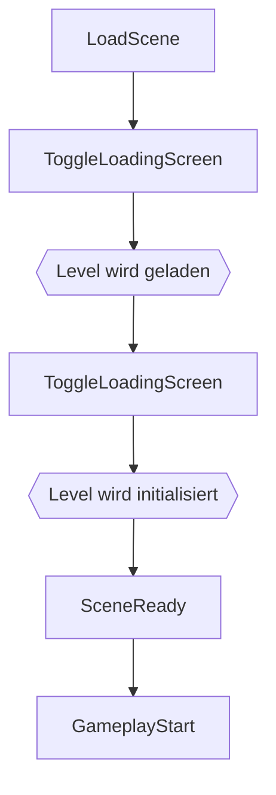

Solltest Du nicht Wissen, was genau ein Event-Sytem ist, dann schau am besten einmal [hier](explanation/).

## Bestehende Events

Bestehende Events findest Du im Ordner `_Game/ScriptableObjects/Events`.
Zu jedem Event gibt es dort auch eine kleine Erklärung, für was genau es zur Verfügung steht.

## Event-Folgen

### Spielstart

