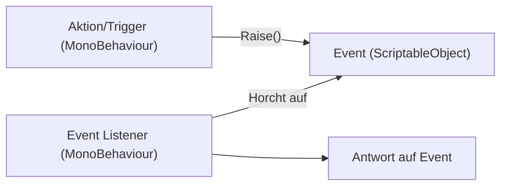
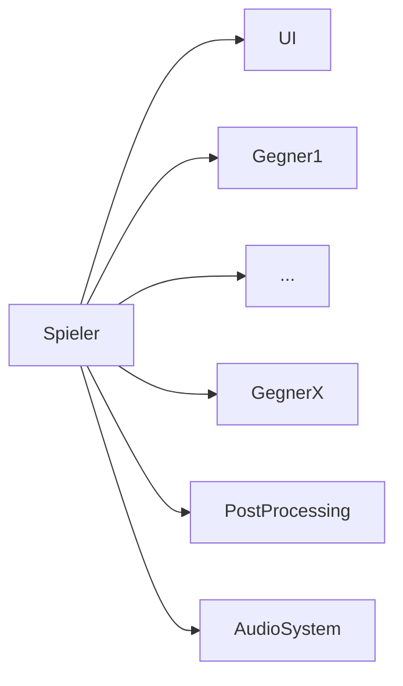
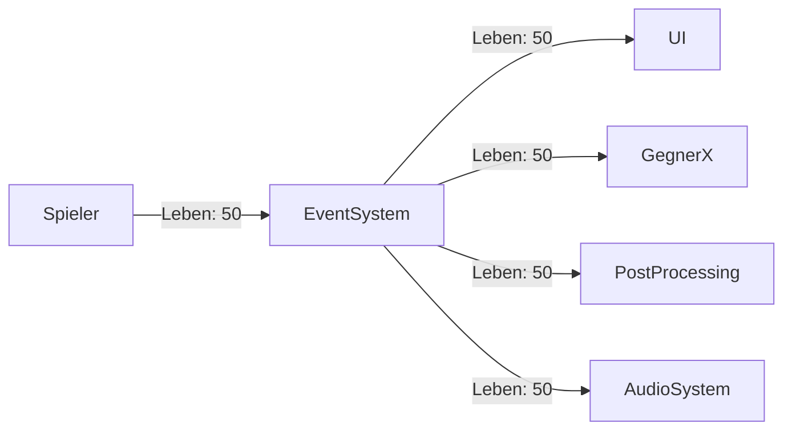

[ [Boundfox YouTube Tutorial](https://www.youtube.com/watch?v=qqzZZfgtQyU&list=PLxVAs8AY4TgeLrapbKxWAmbfwAbTOaLDc&index=2) ]

Wenn Du noch nicht weißt, was ein Event-System ist, dann ist [weiter unten](#was-ist-ein-event-system) eine kleine Erklärung.

## Implementierung

Im Code findest Du das Event-System [hier](https://github.com/BoundfoxStudios/community-project/tree/develop/CommunityProject/Assets/_Game/Scripts/Runtime/Events/ScriptableObjects).
Es besteht aus mehreren Event Channels in Form von ScriptableObjects.
Ein Event Channel ist schlicht ein Kanal über den Informationen laufen.

Jeder kann Informationen in ein Event Channel geben und jeder kann diese Informationen mitbekommen.
Dadurch das wir hier auf ScriptableObjects setzen, können Sender und Empfänger in unterschiedlichen Szenen sein, was z.B. für das [Multi-Scene-Management](multi-scene-management.md) sehr praktisch ist.

## Was ist ein Event-System?

Der Sinn eines Event-Systems ist es, Systeme zu entkoppeln.

Nehmen wir als Beispiel mal das Leben des Spielers.
Wenn der Spieler Leben verliert oder bekommt, möchte man das in der Regel im UI anzeigen.
Jetzt könnte der Spieler eine Referenz auf das UI haben (oder auch umgekehrt) und sobald der Spieler Leben verliert oder gewinnt, diese Änderung direkt an das UI übertragen.
Weiter möchten wir, dass die Gegner sich anders verhalten, je nach dem, wie viel Leben der Spieler hat.
Auch hier könnte jetzt der Spieler alle Gegner kennen und ihnen mitteilen, wenn sich das Leben verändert.
Weiter geht's mit anderen Systemen: Post Processing zum Effekte je nach Leben anzeigen, Audio System, dass entsprechend den Sound ändert etc.

Wenn der Spieler all diese Systeme direkt kennen würde, nennt man dies auch eine hohe Kopplung. 
In der Softwareentwicklung versucht man, genau diese hohe Kopplung zu vermeiden.
Auch wenn dieses Beispiel hier sehr einfach gehalten ist, führt diese Kopplung langsam aber sicher zu schlecht wartbarem Code.
Denn, wann immer man sich die Spieler-Klasse ansieht, sehen wir viele Abhängigkeiten im Code.
Jetzt muss jeder Entwickler schauen, was genau diese Abhängigkeiten machen, um zu verstehen, wie die Spieler-Klasse funktioniert.
Außerdem hat die Spieler-Klasse viel mehr Verantwortung, als sie eigentlich haben müsste, da sie viele Bereiche der Gesamtanwendung kennt und bearbeitet.

Das ist in der Softwareentwicklung _kein_ erstrebenswerter Zustand.

Viel mehr wollen wir eine Entkopplung erreichen und hier tritt unser Event-System ein:

Leider sieht es jetzt durch die Grafik so aus, als hätten wir das Problem zum Event-System verschoben, dass jetzt alle anderen kennt.
Dem ist aber nicht so.
Anstelle dass der Spieler jedes Einzelsystem bearbeitet, nutzt es einfach nur das Event-System und teilt sein aktuelles Leben mit. 
Was jetzt damit passiert, _das ist dem Spieler vollkommen egal_.
In diesem Moment haben wir alles voneinander entkoppelt.
Die Spieler-Klasse hat viel weniger Verantwortlichkeiten, auch für den Entwickler ist es jetzt sehr viel einfacher zu verstehen, da statt viele Einzelsysteme nur noch das Event-System angesprochen wird.
Damit haben wir jetzt eine _lose Kopplung_ erreicht.

Einfach ausgedrückt kann man sich das Event-System als eine Art Walkie-Talkie vorstellen.
Jemand teilt seinen Zustand über das Walkie-Talkie mit, ohne zu wissen, wer diese Nachricht hört, ob sich jemand dafür interessiert und was mit der Information passiert.
