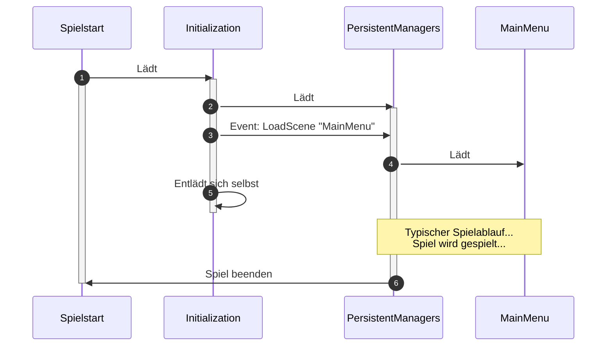

Unity ist in der Lage, mehrere Szenen gleichzeitig laufen zu lassen.
Dabei können wir als Entwickler bestimmen, wann wir neue Szenen dazu laden oder auch welche wieder entladen.
In Unity-sprech ist das ein _additives Laden von Szenen_.

Der Ablauf ist aktuell wie folgt:

* Wir laden zum Start des Spiels die `Initialization`-Szene. Sie hat nur ein einziges Objekt mit dem [InitializationLoader](https://github.com/BoundfoxStudios/community-project/blob/develop/CommunityProject/Assets/_Game/Scripts/Runtime/Infrastructure/SceneManagement/InitializationLoader.cs)-Script. Dieses Script startet das eigentliche Spiel, in dem es zwei weitere Szenen lädt: `PersistentManagers` und das `MainMenu`. Danach wird die `Initialization`-Szene entladen.
* `PersistentManagers` ist eine Szene, die einmalig geladen wird und während der gesamten Laufzeit vom Spiel nie wieder entladen wird. In dieser Szene liegen Objekte/Manager, die wir das gesamte Spiel über benötigen, z.B. Hintergrundmusik oder das Laden von anderen Szenen (via [SceneLoader](https://github.com/BoundfoxStudios/community-project/blob/develop/CommunityProject/Assets/_Game/Scripts/Runtime/Infrastructure/SceneManagement/SceneLoader.cs)-Skript). Über ein [Event-System](../event-system/) können andere Szenen und Objekte mit den `PersistentManagers` kommunizieren. Für den Fall, dass man in Unity den Play Mode von einer anderen Szene aus startet (was durchaus üblich ist), kümmert sich ein `EditorOnly`-GameObject darum, diese `PersistentManagers` zu laden. So, als hätte man das Spiel über die `Initialization`-Szene gestartet. Dieser Vorgang nennt sich im Community-Projekt "EditorColdStartup".

Die Implementierung des Multi Scene Managements findet sich im Ordner [SceneManagement](https://github.com/BoundfoxStudios/community-project/tree/develop/CommunityProject/Assets/_Game/Scripts/Runtime/Infrastructure/SceneManagement).

## Vorteile

### Kein `DontDestroyOnLoad` notwendig

`DontDestroyOnLoad` (DDOL) bringt einige Nachteile mitsich:

* Es wird oft in Zusammenhang mit dem Singleton-Pattern implementiert. Das bedeutet, dass Unity das Objekt erstellt, das Skript dann prüft, ob es bereits existiert und falls ja, sich automatisch wieder zerstört. Das sind unnötig verbratene Ressourcen.
* Oft kann DDOL mit einem ScriptableObject ersetzt werden, da DDOL gerne für das Speichern von Laufzeitdaten verwendet wird, die man überall benötigt.
* Diesen Mechanismus kann man durch Multi Scene Management sehr einfach mit den PersistentManagers erreichen, da diese im Spiel immer zur Verfügung stehen.

### Kein code-typisches Singleton-Pattern notwendig

Oft wird zusammen mit DDOL auch im Code ein Singleton-Pattern implementiert.
Das bedeutet, dass das Objekt selbst entscheidet, ob es ein Singleton ist oder nicht.
Das führt dann in der Regel dazu, dass man durch seine gesamte Codebase hinweg von überall den Zugriff auf irgendwelche Singletons sieht, was wiederum zu einer hohen Kopplung führt.
Warum das schlecht ist, wird im [Event-System](../event-system/) erklärt.

Dennoch gibt es Anwendungsfälle, bei denen Singletons praktisch sind. 
Denn das Pattern als solches ist per-se erstmal nicht schlecht, sondern oft dessen Anwendung ist das, was es schlecht macht.
Bei Multi Scene Management können wir ein Singleton ganz einfach erreichen, in dem wir ein GameObject in der `PersistentManagers`-Szene ablegen.
Dadurch, dass diese einmalig geladen wird und das gesamte Spiel lebt, haben wir jetzt eine Instanz von einem Objekt, dass wir verwenden können, ergo ein Singleton.

Zudem kommt, dass Singeltons auch oft als Datencontainer, ähnlich wie bei DDOL, genutzt werden.
Auch hier haben wir bereits ein Board-Mittel von Unity: ScriptableObjects.

Typische Anwendungsfälle sind hier z.B. Dinge wie:

* Scene Management
* Hintergrundmusik
* Analytics
* Ladebildschirm

## Nachteile

Natürlich bringt das Multi Scene Management auch Nachteile mit sich.

* Komplexität: Gerade für Anfänger, die bisher nur mit einer Szene gearbeitet haben, kann Multi Scene Management zu Beginn sehr komplex wirken.
* Umdenken: Eigentlich was positives, aber anfänglich eher als Nachteil zu sehen: Man muss umdenken, wie der Code strukturiert ist, da man auf gewisse Dinge eben nicht sofort Zugriff hat, sondern eine Indirektion, z.B. über das [Event-System](../event-system/) gehen muss.
