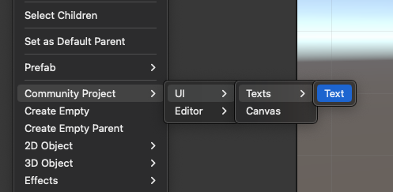
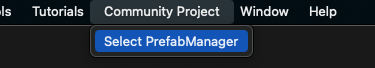
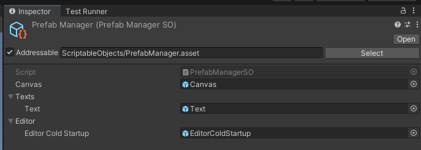

## UI Prefabs

Wir nutzen ein kleines System, um einfacher Prefabs für das UI finden zu können.
Generell liegen die Prefabs im Ordner `Prefabs/UI`.

Um komfortabel ein UI zusammenbauen zu können, integrieren wir unsere eigenen Prefabs auch in das Menü von Unity (Rechtsklick in der Hierarchy).
Auf diese Art funktioniert das Zusammenstecken von UI-Elementen ähnlich wie bei den Standard-Unity-Elementen.

Damit das ganze funktioniert, nutzen wir eine Instanz von `PrefabManagerSO`, dass alle Prefabs sammelt, die in diesem Menü angezeigt werden.
Du findest die Instanz unter `ScriptableObjects/PrefabManager`, oder einfach im Menü auf `Community Project` -> `Select PrefabManager`.

Im Inspektor siehst Du, welche Prefabs verknüpft sind und genutzt werden können.

Wenn Du hier eigene Prefabs hinzufügen möchtest, musst Du den [PrefabManager im Code](https://github.com/BoundfoxStudios/community-project/blob/develop/FairyTaleDefender/Assets/_Game/Scripts/Runtime/EditorExtensions/ScriptableObjects/PrefabManagerSO.cs) und die [Menü-Einträge](https://github.com/BoundfoxStudios/community-project/tree/develop/FairyTaleDefender/Assets/_Game/Scripts/Editor/Menus/GameObjectMenu) erweitern.

### Ich finde nicht, was ich brauche.

Es kann durchaus sein, dass Du UI umsetzen möchtest, aber es dafür noch keine passenden Prefabs findest.
Am Besten legst Du diese dann an und fügst wie, wie im Abschnitt zuvor beschrieben, dem PrefabManager hinzu.
