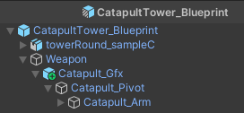
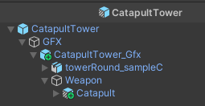

Auf dieser Seite findet sich die Dokumentation, wie man einen Turm im Spiel erstellen und organisiert ablegen kann.
Wichtig zu verstehen ist, dass der Turm selbst keine großartige Funktion hat.
Oft würde die Funktion, z.B. von einem Katapult-Turm, direkt "in den Turm" implementiert werden.
Wir gehen im Spiel allerdings einen anderen Ansatz und sehen die Waffe als eigenständige Waffe, die die eigentliche Funktion implementiert hat.
Der Turm ist nur ein "Etwas", das die Waffe trägt.
Daher ist es wichtig, sich auch den Abschnitt über [Waffen](../weapons/) durchzulesen.

## Organisation

### Prefabs

Im Ordner `_Game/Prefabs/Buildings/Towers` befinden sich alle vom Spieler baubaren Türme.
Jeder Turm bekommt hier seinen eigenen Ordner.

Als Beispiel zeigt das Bild den "CatapultTower":

Jeder Turm besteht aus drei Prefabs:

1. `Turmname_Gfx`: Beinhaltet die grafische Umsetzung des Turms ohne weitere Scripts.
2. `Turmname_Blueprint`: Ist eine Variante von `Turmname_Gfx`, bei dem die Materialen zum `Blueprint` geändert wurden.
  Diese Repräsentation wird genutzt, um dem Spieler ein "Geist"-Element anzuzeigen, wo der Turm gebaut werden kann.
  Im Bild sieht man links den Blueprint/Geist und rechts den gebauten Turm.

  

3. `Turmname`: Der eigentliche funktionierende Turm, der im Spiel platziert wird. Er nutzt `Tower_Base` als Basis-Prefab,
`Turmname_Gfx` für die visuelle Darstellung und eine Waffe. Wie genau alles zusammengestöpselt ist, erklärt der Abschnitt [Turmaufbau](#Turmaufbau).

### ScriptableObject

Zu jedem baubaren Turm gehört ein ScriptableObject, das im Ordner `_Game/ScriptableObjects/Buildings/Towers` abgelegt wird.

In diesem ScriptableObject stehen aktuell nur, welches Prefab gebaut werden kann und welches Prefab als Blueprint dient.

## Turmaufbau

Im weiteren wird beschrieben, wie die drei Prefabs für einen Turm aufgebaut sind.

### Gfx-Prefab

* Basis-Prefab.
* Beinhaltet direkt das Modell oder Modelle für die visuelle Repräsentation.
* Beinhaltet ein leeres GameObject "Weapon" das dort platziert, wo später die Waffe vom Turm stehen wird.

### Blueprint-Prefab

* Varianten-Prefab vom obigen Gfx-Prefab.
* Hier werden alle Materialen (sofern nötig) zum Blueprint-Material geändert.
* Sollte der Turm irgendwelche Effekte haben, die wir im Baumodus nicht benötigen, dann können sie hier ausgeschaltet werden.
* In das GameObject `Weapon` wird jetzt die visuelle Repräsentation einer Waffe gelegt (siehe [Waffenaufbau](../weapons/#Waffenaufbau).

### Turm-Prefab

* Varianten-Prefab von `Tower_Base`.
* In das GameObject `GFX` wird das Gfx-Prefab (siehe oben) abgelegt.
* Beinhaltet alle Scripts, um den Turm zum Leben zu erwecken.