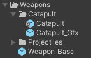

Auf dieser Seite finden sich alle Informationen zu den im Spiel implementierten Waffen und wie man neue Waffen erstellen kann.
Wichtig ist, dass mit Waffe nicht der Turm gemeint ist.
Der [Turm](../towers/) ist eine recht dümmliche Struktur, die nur zum Tragen einer Waffe dient.

Die Waffe implementiert die Funktion, um z.B. ein Katapult zum Abschuss zu bringen.
Daher unterscheiden wir die [Waffen nach ihrer Art](weapon-types/), z.B. ballistische Waffen (Katapult), direkte Waffen (Gewehre), etc.

## Organisation

Ähnlich wie [Türme](../towers/) bestehen Waffen aus Prefabs und ScriptableObjects.

### Prefabs

Im Ordner `_Game/Prefabs/Weapons` befinden sich alle Waffen.
Jede Waffe bekommt hier einen eigenen Ordner.

Als Beispiel zeigt das Bild das "Catapult":

Jede Waffe besteht aus zwei Prefabs:

1. `Waffenname_Gfx`: Beinhaltet die grafische Umsetzung der Waffe ohne weitere Scripts.
2. `Waffenname`: Ist eine Variante von `Waffenname_Gfx` und beinhaltet alle Scripts, um die Waffe zum Leben zu erwecken.

### ScriptableObject

Zu jeder Waffe gehört ein ScriptableObject, das im Ordner `_Game/ScriptableObjects/Weapons` abgelegt wird.

In diesem ScriptableObject werden alle Parameter für eine Waffe festgehalten, z.B.

* Reichweite
* Mindestreichweite
* Angriffswinkel
* etc.

Diese Werte sind als Basiswerte zu verstehen und werden später durch Forschung verbessert werden können.

## Waffenaufbau

### Gfx-Prefab

* Basis-Prefab.
* Beinhaltet direkt das Modell oder Modelle für die visuelle Repräsentation.

### Waffe-Prefab

* Varianten-Prefab vom obigen Gfx-Prefab.
* Beinhaltet alle Scripts, um die Waffe zum Leben zu erwecken.

* Eine Waffe nutzt je nach Waffenart ein bestimmtes Script.
  * z.B. benutzt eine ballistische Waffe das Script `BallisticWeapon`.
  * Hier wird das ScriptableObject für die Waffendefinition verknüpft (siehe [oben](#ScriptableObject) als auch ein [Target Locator](target-locator/).
  * Zusätzlich wird das Prefab für ein [Projektil](weapon-types/#Projektile) bestimmt.