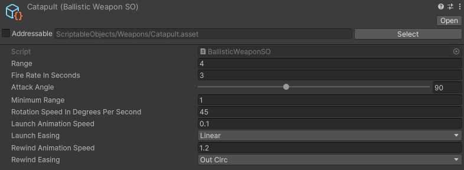

Die Idee der Gruppierung in Waffenarten ist, dass man ähnliche Waffen nicht mehrfach implementieren muss.
Ein Beispiel wäre ein Katapult und ein Trebuchet.
Beides sind ballistische Waffen, die in ihrer Grundfunktion gleich sind: Sie schleudern ein Projektil auf den Gegner.
Der Unterschied ist am Ende nur etwas in der Animation, (Mindest-)Reichweite und Stärke.
Ansonsten sind diese Waffen gleich.
Es wäre daher nicht gut, wenn wir beide Waffen jedes mal von Grund auf implementieren müssten.

Im Ideallfall nutzen beide das gleiche Script für eine ballistische Waffe und unterscheiden sich nur in den Parametern und natürlich im visuellen Modell.

## Ballistische Waffen

Zu ballistischen Waffen gehören z.B. Katapulte, Trebuchets, etc. - alles, was ein Projektil durch die Luft schleudert.
Charakteristisch für diese Waffen ist oft, dass sie ungenau sind, aber dafür Flächenschaden anrichten.
Auch sind sie oft recht langsam und das Projektil benötigt einige Zeit, um das Ziel zu treffen.
Für ballistische Waffen exitiert ein ScriptableObject vom Typ `BallisticWeaponSO`.

Beispiel vom Katapult:

### Projektile

Ballistische Waffen verschießen Projektile, die aktuell so implementiert sind, dass sie physikalisch korrekt fliegen.
Ein Projektil hat einen dynamischen Rigidbody und wird durch die Gravitation nach unten gezogen.
Beim Start ein Projektiles wird einmalig die Abschussgeschwindigkeit (Velocity) bestimmt, anhand derer das Projektil zu seinem Zielpunkt fliegt.

#### Schaden

Bei Kollision fügen Projektile Gegnern Schaden zu. Dazu benötigt jedes Projektil eine weitere Komponente, die das Interface IDealDamageOnCollision implementiert.

Hierfür gibt es derzeit 2 Implementierungen:
1. Einzelschaden: Die Komponente SingleTargetDamageOnCollision trifft nur genau das Ziel, mit dem das Projektil kollidiert.

2. Flächenschaden: Die Komponente AreaDamageOnCollision nutzt einen SphereCast um potenziell mehreren Gegnern im gegebenen Radius vom Ort der Kollision Schaden zuzufügen. 

Anschließend wird in beiden Fällen das GameObject welches das Projektil darstellt gelöscht.