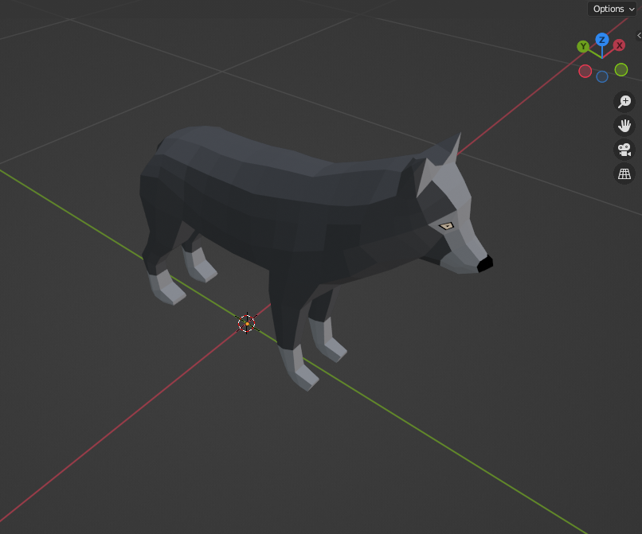
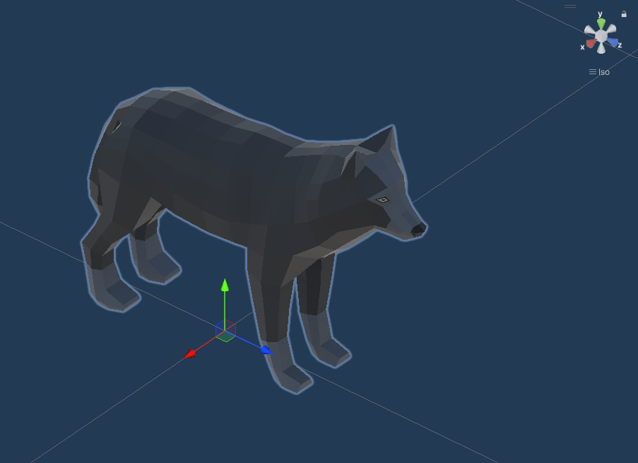

Hier findest Du die visuelle Dokumentation.

Wenn Du Dich interessiert, [Dich visuell zu beteiligen](../contributing/visual/), also dem Erstellen von 3D-Modellen oder 2D-Grafiken, dann solltest Du Dir alle Informationen hier durchlesen.

### Worauf muss ich achten?

### 3D

* Quasi Low Poly: Wir machen im Projekt nicht super harte Low Poly Umsetzung, aber eben auch kein High Poly. 
  Versuche Polys zu vermeiden, wo Du keine benötigst und nutze gerne dort ein paar mehr, wo es benötigt wird.
* Bitte achte darauf, dass alle Pivots korrekt gesetzt sind, gerade bei Dingen, die animiert werden sollen oder von Dir animiert wurden.
  Das Pivot vom Gesamtmodell soll unten in der Mitte des Modells sein.
* Orientierung an den Unity-Achsen:
  * X-Achse: entspricht X+ in Blender
  * Y-Achse: entspricht Z+ in Blender
  * Z-Achse: entspricht Y- in Blender
    
    Wenn Du etwas modellierst, dass eine Richtung hat (z.B. ein Tier, ein Charaketer, ein Waffe), dann musst Du diese in Blender so ausrichten, dass die Richtung, in die das Objekt schaut, in Richtung Y- orientiert ist. Siehe hier z.B. unseren Wolf:

    

    In Unity orientiert sich das Objekt dann mithilfe unseres [Export-Scripts](blender/) automatisch korrekt der Z-Achse.

    

* Skalierung: 1 Blender Unit = 1 Meter = 1 Unity Unit.
  Wenn wir Dein Modell in Unity importieren, muss es mit einem 1/1/1 Scaling bereits die korrekte Größe haben.
* Benutze bitte keinerlei Texturen, außer die [Farbpaletten-Texture](colors/).
* Bitte beachte, dass die Shader Deiner Modellierungssoftware nicht mit Unity kompatibel sind. D.h. im Idealfall benötigt Dein Modell keinen eigenen Shader. Falls Du allerdings, Ausnahmen bestätigen die Regel, ein Modell/Aufgabe hast, die einen eigenen Shader benötigt, muss dieser Shader in Unity entwickelt werden. Du kannst ihn zwar in Deiner Modellierungssoftware auch erstellen, er dient dann allerdings nur als Referenz für die Unity-Shader-Entwicklung.
* Einfache Modelle sollten aus nur einem Mesh bestehen.
* Exportiere Deine Modelle als `.fbx` (speziell für [Blender siehe hier](blender/)).

#### Wie benenne ich meine Modelle?

* Benenne Deine Meshes, Animationen etc. korrekt (und auf Englisch, dict.cc hilft beim Übersetzen), denn niemand weiß, was `Cube 1` und `Animation 3` nachher wirklich ist. 
* Benenne Dein Objekt so:
  * Zuerst mit dem Typ, z.B. `Tree` (Baum), `Bush` (Busch), 
  * dann mit dem Namen der Variante, z.B. `1`, `2`
  * und dann abgetrennt mit einem Unterstrich `_` die Modifikation davon (z.B. `Large` (Groß), `Small` (Klein)).
  * Beispiele:
    * Ein großer und kleiner Baum: `Tree_1_Large`, `Tree_1_Small`
    * Ein Schatzkiste: `TreasureChest`
    * Eine grüne/gelbe Blume: `Flower_Green`, `Flower_Yellow`

#### Mixamo

Leider kannst Du im Projekt nicht auf die Animationen von Mixamo zurückgreifen. 
Mixamo erlaubt zwar das Nutzen von Animationen in privaten und kommerziellen Projekten, aber [nicht das Verteilen der Animationen](https://community.adobe.com/t5/mixamo-discussions/redistribute-mixamo-animations-as-part-of/m-p/11554550).
In dem Moment, in dem wir die Animationen hier auf GitHub hochladen, verteilen wir diese und verstoßen damit gegen die Lizenz.

### 2D

* Dein Bild sollte so klein wie möglich und so groß wie nötig sein.
* Farben bzw. Farb-Palette muss sich im Laufe des Projektes noch finden.
* Wenn Du Bilder für die Benutzeroberfläche erstellst, sollte dieses in der Regel ein sogenanntes "9-slicing Sprite" sein, siehe hierzu die [Dokumentation bei Unity](https://docs.unity3d.com/Manual/9SliceSprites.html). Es handelt sich hier um eine Standard-Technik, daher findest Du mit diesem Begriff einiges mehr über die Suchmaschine Deiner Wahl.
* Exportiere Deine Arbeit als `.png`.