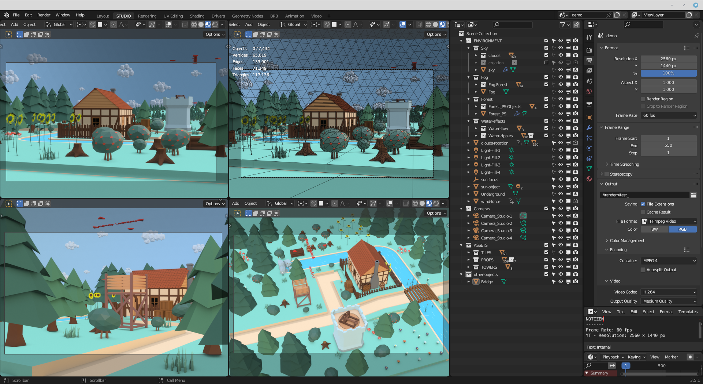

Studio für Videosequenzen für das Spiel.

* Software: Blender v3.5
* Add-ons erforderlich: nein

[Download](assets/BlenderStudio.zip)

## Assets

In der Collection `ASSETS/` befinden sich die referenzierten 3D-Modelle aus den externen Dateien (Props, Tiles, usw.).

## Himmel mit Wolken
**Collection: ENVIRONMENT/Sky**

Viele kleine Wolken in tieferer Ebene und einige größere Wolken am Himmel.
* Wolken wurden mittels Particle System vervielfacht und händisch etwas aufgeteilt

### Steuerung

Steuerbar sind die Wolken über den Z-Winkel vom Objekt: ENVIRONMENT/clouds-rotation

Für eine sanfte Bewegung der Wolken wurde eine Action erstellt die per Blending:Add 1° Drehung hinzufügt. 
Für die andere Bewegungsrichtung genügt es auf Blending:Subtract umzustellen.

## Sonne / Licht
**Collection: ENVIRONMENT/**

* /sun-object
  - Light_1-Key
  - Light_1-Keyhelper
* /sun-focus
* /Light-Fill-.. (.. = 1,2,3,usw.)

Die Sonne dient auch als primäre Lichtquelle (Key). 
Die sekundären Lichtquellen (Fill) imitieren die indirekte Beleuchtung. 
Für manche Szenen könnte auch eine Sonne interessant sein, deshalb die grafische Umsetzung.

### Steuerung

Platzierung der Sonne über die Winkel (X,Y,Z) vom Objekt: ENVIRONMENT/sun-object

Steuerung/Fokus vom Lichtkegel der Sonne mittels Objekt: ENVIRONMENT/sun-focus

## Waldgebiet (Wald im Hintergrund)
**Collection: ENVIRONMENT/Forest**

* Waldgebiet wird mittels Particle System (PS) generiert
* nur Objekte die in der Collection "Forest_PS-Objects" enthalten sind werden berücksichtigt

## Nebel
**Collection: ENVIRONMENT/Fog**

Ein leichter Nebel auf ganzer Map und etwas stärkere Nebel-Abschnitte im Waldgebiet.

* einzelne kleine Abschnitte für das Waldgebiet
* Umsetzung Nebel mittels Shader

## Wassereffekte
**Collection: ENVIRONMENT/Water-effects**

### Strömung "Water-flow"

* eigenes Objekt über dem Tiles
* Umsetzung mittels Shader

### Wasserringe "Water-ripples" (Ringe bei Hindernisse)

* eigenes Objekt über dem Tiles
* Umsetzung durch eine Mischung aus Geometry Nodes, Mesh Attributs und Shader
* nur Objekte die in der Collection "water_Edge-cutters" enthalten sind werden berücksichtigt

## Wind

* Umsetzung durch eine Mischung aus Simple Deform Modifier und Drivers zur zentralen Steuerung
* alle Objekte die vom Wind beeinflusst werden sollen (z.B. Bäume, Sträucher) benötigen den Modifier
* Windstärke wird durch "Angle" beeinflusst, die Feineinstellung erfolgt durch "Limits"

### Steuerung

Zur einfacheren Regulierung wurden Actions erstellt, Objekt: ENVIRONMENT/wind-force

In der NLA kann ein sanfter Wind mit Windböen zusammengestellt werden.

{}
Wir hätten den Wind in Blender gerne wie in Unity (mittels UV-Map, anhand der Y-Achse) umgesetzt. Falls Du die Umsetzung mit Geometry Nodes probieren möchtest, dann wende Dich an einen [Ansprechpartner](https://github.com/boundfoxstudios/fairy-tale-defender#ansprechpartner).
{}

