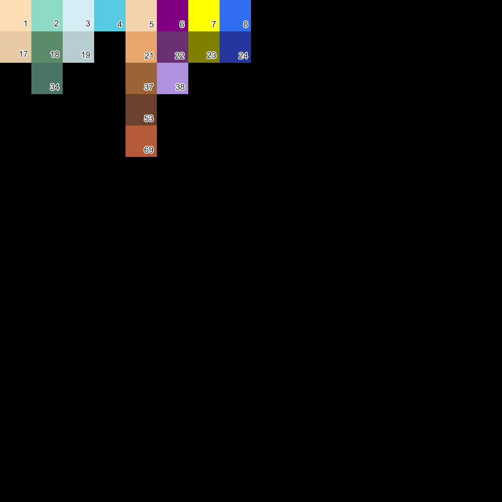

Alle Elemente im Spiel orientieren sich an einer Farbpalette.
Es wird "pro Jahreszeit" eine Farppalette geben.

Jede Farbpalette ist 16x16 Pixel groß und bietet somit Platz für 256 verschiedene Farben.
Das sollte mehr als ausreichend sein.

Anwenden kannst Du Farben in [Blender via UV Editing](https://www.youtube.com/watch?v=8NEmx0cHwoI).

> Wenn Dir eine Farbe fehlt, schreib uns auf dem [Discord]() eine Nachricht, sodass wir die Farbe hinzufügen können.

{}
Du kannst die Farbpalette [hier](../blender/) im Blender Starter-Kit herunterladen.
{}

## Sommer

Hier siehst Du die Farbpalette für den Sommer:

| #   | Beschreibung              |
| --- | ------------------------- |
| 1   | Erde                      |
| 17  | Dunkle Erde               |
| 2   | Gras                      |
| 18  | Blatt Schattierung 1      |
| 34  | Blatt Schattierung 2      |
| 3   | Stein                     |
| 19  | Dunkler Stein             |
| 4   | Wasser                    |
| 5   | Holz Schattierung 1       |
| 21  | Holz Schattierung 2       |
| 37  | Holz Schattierung 3       |
| 53  | Holz Schattierung 4       |
| 69  | Dachziegel                |
| 6   | Blume Lila Schattierung 1 |
| 22  | Blume Lila Schattierung 2 |
| 38  | Blume Lila Schattierung 3 |
| 7   | Blume Gelb Schattierung 1 |
| 23  | Blume Gelb Schattierung 2 |
| 8   | Blume Blau Schattierung 1 |
| 24  | Blume Blau Schattierung 2 |
| 9   | Weiß                      |
| 25  | Schwarz                   |
| 10  | Pilz-Rot                  | 