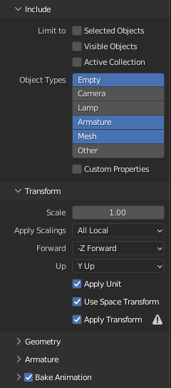

Hier findest Du das Blender Starter-Kit.
Enthalten ist einmal das [Basis-Tile-Set](../tiles/) und alle aktuellen [Farbpaletten](../colors/).

[Klicke hier, um das Blender Starter-Kit herunterzuladen](assets/BlenderStarterKit.zip).

## Export-Einstellungen

Wenn Du mit Deinem Modell fertig bist und es exportieren willst, dann beachte bitte folgende Dinge:

* Exportiere pro Modell eine eigene FBX-Datei.
* Achte darauf, dass das Modell im Ursprung liegt, bevor Du es exportierst.
* Stelle die folgenden Einstellungen im Export-Dialog ein:



Wenn Du mehrere Modelle in einer Blender-Datei hast, dann ist folgendes Script nützlich für den Export:

### Export-Script

Wechsle in das Scripting-Tab von Blender und erzeuge ein neues Script.
Kopiere dann folgendes Script in den leeren Text-Editor.

Danach musst Du alle Modelle, die Du exportieren willst, in der Scene Collection markieren und dann auf den "Play"-Button in Blender drücken.
Blender wird daraufhin alle Modelle mit unseren gewünschten Einstellungen exportieren und dort ablegen, wo auch die Blender-Datei liegt.

```python
# exports each selected object into its own file

import bpy
import os

# export to blend file location
basedir = os.path.dirname(bpy.data.filepath)

if not basedir:
    raise Exception("Blend file is not saved")

view_layer = bpy.context.view_layer

obj_active = view_layer.objects.active
selection = bpy.context.selected_objects

bpy.ops.object.select_all(action='DESELECT')

for obj in selection:

    obj.select_set(True)
    
    # Save the initial location and set the object to 0/0/0
    oldLocation = obj.location.copy()
    obj.location = (0, 0, 0)

    # some exporters only use the active object
    view_layer.objects.active = obj

    name = bpy.path.clean_name(obj.name)
    fn = os.path.join(basedir, name)

    bpy.ops.export_scene.fbx(
        filepath=fn + ".fbx", 
        use_selection=True, 
        object_types= {'MESH', 'ARMATURE', 'EMPTY'}, 
        use_mesh_modifiers=True,
        mesh_smooth_type='OFF',
        use_custom_props=True,
        bake_anim_use_nla_strips=False,
        bake_anim_use_all_actions=False,
        apply_scale_options='FBX_SCALE_ALL',
        bake_space_transform=True)

    # Restore the old location    
    obj.location = oldLocation

    obj.select_set(False)

    print("written:", fn)


view_layer.objects.active = obj_active

for obj in selection:
    obj.select_set(True)
```