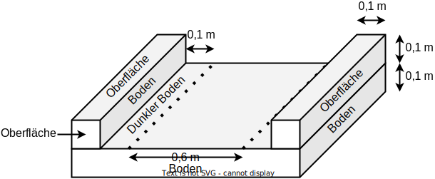

## Basis-Tile

Eine Tile ist der Grundbaustein zum Zusammensetzen des Terrains.
Es ist ein 1 Meter langer, 1 Meter breiter und 0,2 Meter hoher Quader.

Die Höhe, 0,2 Meter, teilt sich auf 0,1 Meter Boden und 0,1 Meter Oberfläche.

An diesem Tile orientieren sich alle weiteren Modellierungen.

## Weg-Tile

Ein Weg-Tile beschreibt ein Tile, auf dem die Gegner laufen.

Der Weg ist 0,8 Meter breit.
Die Seiten sind jeweils 0,1 Meter breit.

Auf dem Weg wird über Farbe eine leichte Schattierung erzeugt.
Hierzu werden seitlich am Weg jeweils 0,1 Meter genutzt.
Siehe gestrichelte Linie in der Beschreibung "Dunkler Boden" im Bild.

Bitte achte darauf, diese Maße exakt einzuhalten, ansonsten können wir die Tiles im Spiel nicht zusammensetzen.

So sieht z.B. ein Weg-Tile fertig modelliert und gerendert aus:

## Turm

Ein Turm wird auf einem Tile platziert.
Darf maximal 0,9 Meter breit und lang sein, sodass er niemals das ganze Tile einnimmt (sähe sonst komisch aus, wenn man Türme nebeneinander baut).
Die Höhe kann je nach Turm etwas variieren und sollte auch um 1 Meter herum sein.
Die Basis vom Turm kann rund oder eckig sein.

## Origin

Der Origin aller Objekte befindet sich unten in der Mitte vom Objekt.