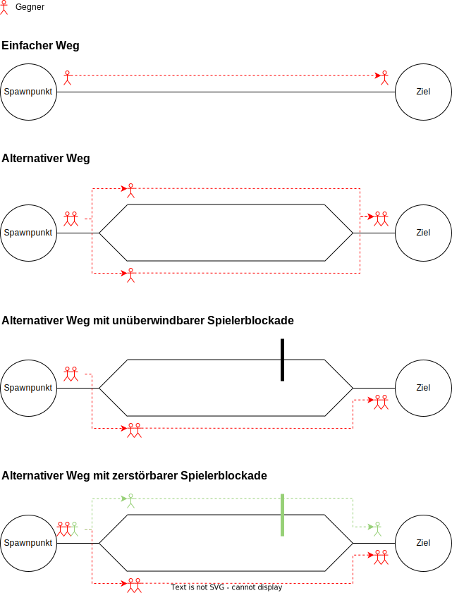

## Wellen

Typisch für ein Tower Defense Spiel ist, dass Gegner in Wellen erscheinen.
Anfängliche Wellen starten mit leichteren Gegnern.
Je länger ein Spieler durchhält, umso schwerer werden die Gegner in jeder Welle.

"Schwer" in diesem Zusammenhang bedeutet, dass ein Gegner mehr Lebenspunkte, mehr Rüstung oder z.B. höhere Elementar-Widerstände hat.
Zum aktuellen Zeitpunkt ist noch nicht klar, welche Attribute ein Gegner haben wird.
Zu keinem Zeitpunkt kann der Gegner den Spieler bzw. die Türme des Spielers angreifen.

## Arten von Gegner

* Bodeneinheiten
* Lufteinheiten
* Mini-Bosse
* Boss-Gegner
* End-Boss

## Anzahl der Gegner

Gegner sollen sich wertig anfühlen.
Daher wird es keine Masse an Gegner geben, die durch die Türme angegriffen wird, sondern wenige.
Klasse statt Masse ist die Devise.

## Wege

Die Gegner laufen auf vorgefertigten Wegen von ihrem Spawnpunkt zum Ziel.
Hierbei kann es sich entweder um Boden- oder Lufteinheiten handeln.
Auf dem Weg werden sie von den Türmen beschossen und nehmen Schaden, bis sie entweder sterben oder am Ziel ankommen.
Kommen sie am Ziel an, nimmt der Spieler Schaden.

### Wegbeeinflussung durch den Spieler

Der Spieler soll die Möglichkeit haben, die Wege beeinflussen zu können.
Wie genau ist zu diesem Zeitpunkt noch offen.
Erste Ideen finden sich [hier](../../../docs/ideas/navigation/).

Das Verändern der Wege soll eine bewusste Entscheidung durch den Spieler sein.
Wenn er dies macht, sollte es auch einen negativen Einfluss auf den Spieler haben.
Wie genauer dieser aussieht, steht zu aktuellen Zeitpunkt noch nicht fest. 

Die Gegner sind intelligent und wissen, wann ein Weg blockiert ist und nehmen dann direkt eine alternative Route.
Falls ein Gegner (z.B. Fluggegner) über eine Blockage fliegen kann, wird er den Weg über die Blockade gehen.
Falls eine Blockage durch einen Gegner zerstört werden kann (siehe [Ideen](../../../docs/ideas/navigation/)), wird er den Weg der Blockade gehen und diese zerstören.
Somit wird der Weg wieder frei für alle Gegner.
