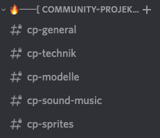
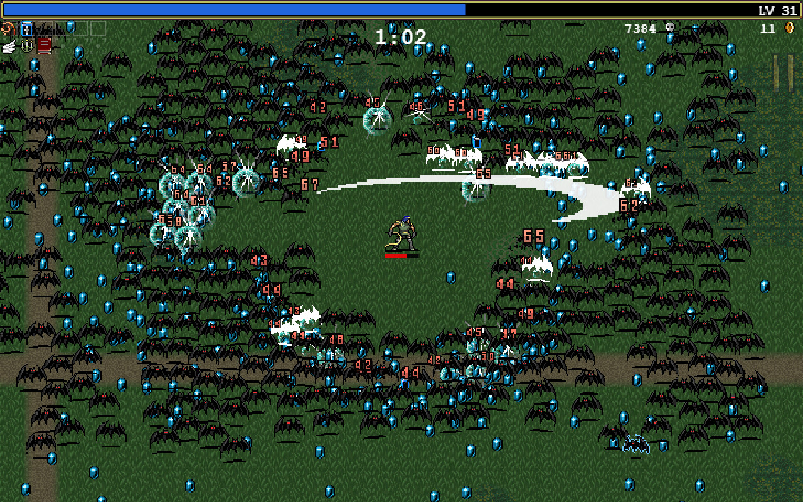
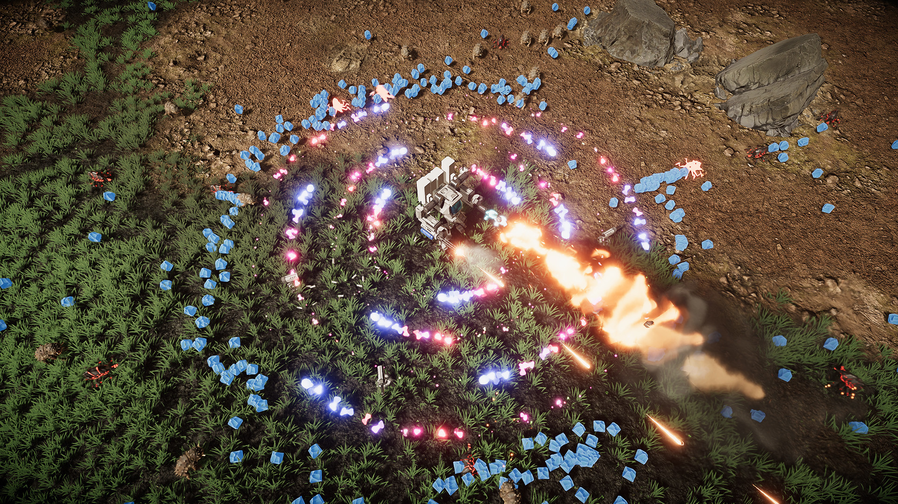
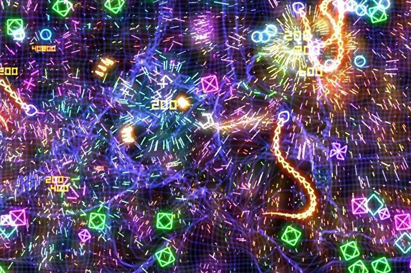
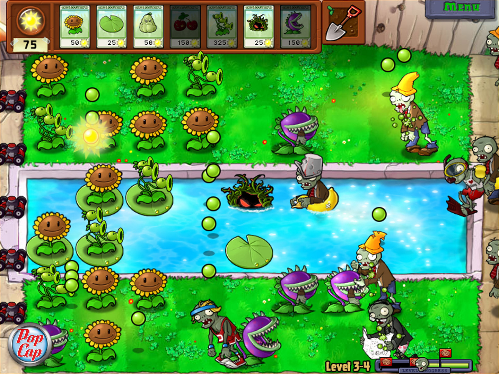
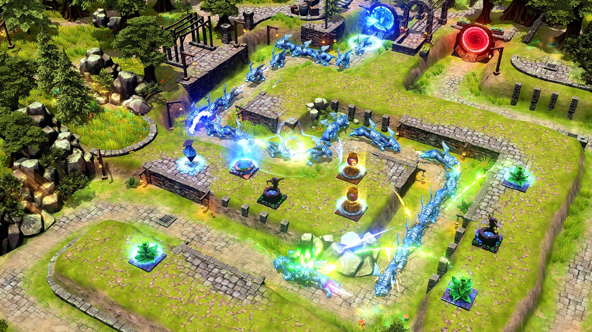
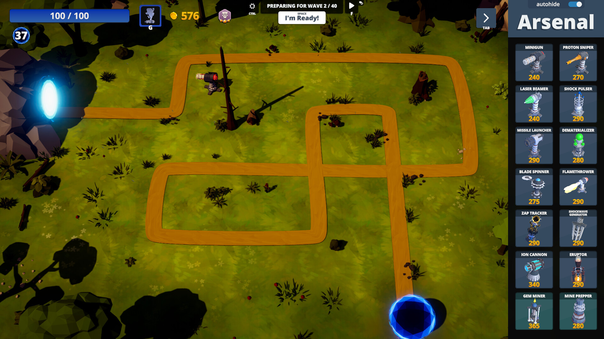

---
class:
  - invert
---

# Boundfox Studios
## Community Project

---

# Agenda

* Ziel
* Kommunikation
* Rahmen
  * Technisch
  * Kreativ
* Auswahl des Genres

---

# Bevor's los geht

Viele Informationen, die hier in der Präsentation stehen, werd ich auch nochmal schriflich bereitstellen.

---

# BFSORDNG

<!-- Boundfox Studios Online Rollenspiel der nächsten Generation -->

---

# Ziel

* Kleines, fertiges Spiel, kostenfrei auf Steam spielbar
* Jeder kann sich einbringen
* Lernen, lernen, lernen...
* Spaß!

---

# Jeder kann sich einbringen

* Entwickler
  - Game Code
  - Shaders
  - Editor-Erweiterungen
* 3D-Artist
  - Modelle (Gebäude, Umgebung, ...)
  - Characters (Mensch, Tier, ...)
* 2D-Artist
  - Benutzeroberfläche
  - Icons

---

# Jeder kann sich einbringen

* Sound
  - Effekte
  - Musik
* Texter
  - Übersetzungen
  - Dokumentation
  - Steam Store Page
* Organisation
* ...

---

# Verlässlichkeit!

---

# Kommunikation

## YouTube

* Projekt-Update
* Dev-Logs
* 2-wöchentlich (zwischen den Tutorials)

---

# Kommunikation

## Discord

* Alltägliche Kommunikation
* Umfragen
* Entscheidungsfindung

---

# Kommunikation

## GitHub

* https://github.com/boundfoxstudios/community-project
* Hosting vom Code, Assets, etc.
* Bug-Management
* Am besten GitHub Desktop als Software nutzen für den Zugriff
  - Kleines Tutorial wird hierzu folgen

---

# Rahmen

## Technisch

* Unity 2022.2.5f1
* Universal Render Pipeline
* dotnet-format: Einheitliche, automatisierte Code-Formatierung
* Code-Editor: Egal, Rider, Visual Studio, Visual Studio Code

---

# Rahmen

## Kreativ

* 3D
* Richtung Low Poly
* Unity-Achsenorientierung
  - X-Achse: nach rechts
  - Y-Achse: nach oben
  - Z-Achse: nach vorne
* 1 Unity-Unit = 1 Meter = 1 Blender Unit
* Farb-Palette, Shaders, etc. müssen sich erst noch finden

<!-- Kann das jemand aus der Community überwachen, dass die Modelle korrekt sind? -->

---

# Auswahl des Genres

## Bullet Hell

Klassisches Bullet Hell

---

<!-- _color: white -->

# Vampire Survivor

(Bild: Steam Store)

---

<!-- _color: white -->

# Project Lazarus

(Bild: Steam Store)

---

<!-- _color: white -->

# Geometry Wars

(Bild: eurogamer.net)

---

<!-- _color: white -->

# Auswahl des Genres

## Tower Defense

Klassisches Tower Defense 

---

<!-- _color: white -->

# Plants vs Zombies

(Bild: Steam Store)

---

<!-- _color: white -->

# Element TD

(Bild: Steam Store)

---

<!-- _color: white -->

# PolyCore Defense

(Bild: Steam Store)

---

# Auswahl des Genres

## Warum diese zwei Genre?

---

# Auswahl des Genres

- Abstimmung via YT-Community Tab.
- Link ist in der Video-Beschreibung oder im Discord.