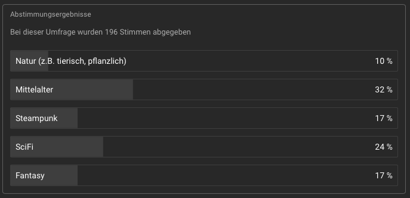

---
class:
- invert
---

# Boundfox Studios
## Community Project

---

# Agenda

* Theme-Reveal
* 3D-Artist-Vorschläge zur Stilfindung
* Entwicklungsupdate

---

# Theme-Reveal

---

# Mittelalter

---

# 3D-Artist-Vorschläge

* Modellierung von 2 Zerstörungstürmen im gleichen Stil
  * z.B. Kanonenturm, Turm mit Katapult, Turm mit Balliste, Turm mit Bogenschützen, ...
* Einreichung eines "isometrischen" Renders
* Wichtig: Modell muss noch nicht optimiert sein, erstmal nur gut ausschauen um den Stil zu zeigen
* Bitte keine Texturen verwenden

---

# 3D-Artist-Vorschläge

* Artists modellieren 2 Assets
    - Wichtig: Nicht mit Optimierung, perfekter Geometrie aufhalten, das kommt später. Wichtig ist das Zeigen vom generellen Grafikstil
* Einreichung privat direkt an Manu (Discord/E-Mail)
* Bei mehr als 4 Einreichungen: Vorselektion in Discord
* Einreichung bis **29.10. 23:59 Uhr**
* Finales Voting via YouTube: **31.10.-07.11.**

---

# Noch Fragen?

- YouTube-Kommentare
- Discord

---

# Entwicklungsupdate
## Fertig

* Salja: Basis für Input Reader mit Input System
* BlackJack237: Audio Mixer
* M4lph: Hintergrundmusikspieler

## In Bearbeitung
* ThKattanek: Credits-Scene
* fastFox2: Dateimanager